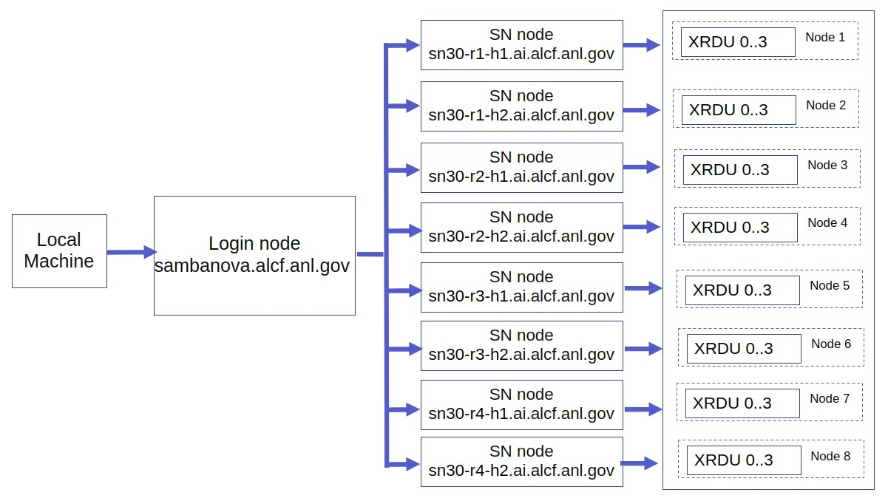

# Getting Started

## On-Boarding

See [Get Started](https://www.alcf.anl.gov/support-center/get-started)
to request an account and additional information.

## Setup

### System View

Connection to a SambaNova node is a two-step process. The first step is to **ssh** to the **login node**.
This step requires an MFA passcode for authentication - an
eight-digit passcode generated by an app on your mobile device, e.g., **MobilePASS+**.
The second step is to log in to a SambaNova node from the **login node**.



### Log in to Login Node

Log in to the SambaNova **login node** from your local machine using the below command. This uses the **MobilePASS+** token generated every time you log in to the system. This is the same passcode used to authenticate into other ALCF systems, such as **Theta** and **Cooley**.

*In the examples below, replace* ***ALCFUserID*** *with your ALCF user id.*

```bash
ssh ALCFUserID@sambanova.alcf.anl.gov
Password: < MobilePASS+ code >
```

Note: Use the ssh "-v" option in order to debug any ssh problems.

### Log in to a SambaNova Node

Once you are on the **login node**, the SambaNova system can be accessed using an alias, e.g., **sn30-r1-h1**. There are four racks, 'r', and two hosts, 'h', per rack.

```bash
ssh sn30-r1-h1
```

### SDK setup

The SambaNova system has a bash shell script to set up the required software environment.
This sets up the SambaFlow software stack, and the associated environmental variables and starts
a pre-configured virtual environment.

Use

```bash
ALCFUserID@sm-01:~$ source /software/sambanova/envs/sn_env.sh
(venv) ALCFUserID@sm-01:~$
```

The contents of the sn_env.sh script is shown below for convenience.

```bash
alias snpath='export PATH=$PATH:/opt/sambaflow/bin' # This is the path to SambaFlow which is the software stack running on SambaNova systems. This stack includes the Runtime, the compilers, and the SambaFlow Python SDK which is used to create and run models.

alias snthreads='export OMP_NUM_THREADS=16' # The OMP_NUM_THREADS environment variable sets the number of threads to use for parallel regions. The value of this environment variable must be a list of positive integer values. The values of the list set the number of threads to use for parallel regions at the corresponding nested levels. For the SambaNova system, it is usually set to 1.

alias snp='snpath;snthreads' # Creates an alias to execute the commands.

snp # Executes the commands.
```

**NOTE:  SambaNova operations will fail unless the SambaNova venv is set
up.**

Each example has its own environment.

You may deactivate an environment if finished.

```bash
deactivate
```
